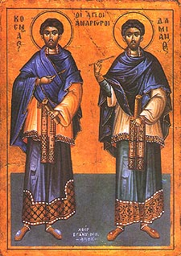

# Saints Cosmas and Damian

[Source [external link]](https://www.oca.org/saints/lives/2012/11/01/103133-holy-wonderworkers-and-unmercenaries-cosmas-and-damian-of-mesopo)

"Heal the sick, cleanse the lepers, raise the dead, cast out devils: freely ye have received, freely give." - Matthew 10:8 (KJV)
			
Saints Cosmas and Damian were brothers born in the 3rd century in Asia Minor to their Godly mother Saint Theodota (yes, she is also a Saint). As they grew, both became skilled physicians, and traveled to those in need, giving away their services for free. For this reason, they are known as the "Unmercenaries".

Unmercenary... what does this mean? A mercenary is a person "primarily concerned with making money at the expense of ethics" (source: Google). Therefore, an un-mercenary is a person "not concerned with making money, and does so for the good of all".

In our own lives, whether we have money, talents, friends, extra food, kindness, a good listening ear, etcetera, let us give freely from ourselves!
			
**May Saints Cosmas and Damian pray to Christ for us, that He may give us the opportunity to use our gifts for the glory of the Kingdom of God!**